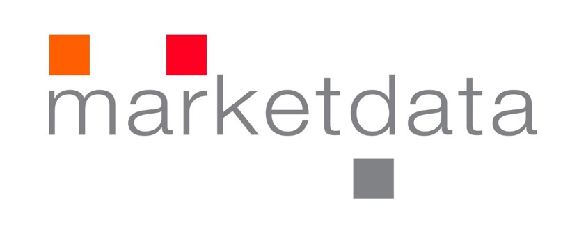

```{r setup, include=FALSE}
knitr::opts_chunk$set(echo = TRUE)
```

O curso-r ensinará como usar o R para auxiliar o aluno na execução de tarefas
corriqueiras de forma eficiente e concisa. O aluno aprenderá a:

- **Carregar** - Carregar o banco de dados para dentro do R. 
- **Arrumar** - Deixar os dados na melhor estrutura para a análise.
- **Transformar** - Agregar, criar novas variáveis etc. 
- **Visualizar** - Criar gráficos e visualizações.
- **Modelar** - Ajustar modelos que ajudam na interpretação dos dados.
- **Comunicar** - Apresentar os resultados de forma eficiente.

O curso será baseado no [*R for Data Science*](http://r4ds.had.co.nz/), que por
sua vez é baseado no [`tidyverse`](http://tidyverse.org/), *universo arrumado*,
um conjunto de pacotes que dividem uma mesma filosofia e foram feitos para serem
utilizados conjuntamente.

## Público Alvo

- Estudantes de graduação em estatística que desejam ganhar tempo nos trabalhos da faculdade e entrar no mercado de trabalho com bons diferenciais.
- Profissionais do mercado de trabalho que desejam inserir o R no fluxo de atividades do setor/empresa.
- Acadêmicos com interesse em tornar suas análises e códigos mais legíveis, reprodutíveis, eficientes e organizados.

## Softwares

O curso será realizado em um laboratório, onde os softwares já estarão instalados. Para fazer os exercícios fora da aula, você precisará instalar os seguintes softwares/pacotes:

- R: Instale pelo site do [CRAN](https://cloud.r-project.org/).
- RStudio: Faça o download [aqui](https://www.rstudio.com/products/rstudio/download/preview/).
- `tidyverse` - No console do R, digite o código abaixo.

```{r eval=FALSE}
install.packages('devtools')
devtools::install_github('curso-r/pu.deps')
```

## Pré-requisitos

Para melhor aproveitamento do curso, é importante o aluno ter alguns conhecimentos sobre **Lógica de programação**. Não se preocupe! Se você já fez qualquer curso de programação na vida, já será o suficiente. 

Se o aluno não for familiarizado com R, recomendamos abrir o RStudio e tentar rodar e entender os comandos [desta página](https://curso-r.github.io/verao2017/r-como-calculadora/). Tente
fazer os [exercícios](https://curso-r.github.io/verao2017/r-como-calculadora/#exercicios).

Durante o curso iremos usar bastante o [Github](https://github.com/). Portanto,
criar uma conta será fundamental.

Familiarize-se com [RMarkdown](http://rmarkdown.rstudio.com/lesson-1.html). O curso utilizará este formato de arquivos extensivamente.

## Horários

O curso faz parte do [programa de verão do IME-USP](https://www.ime.usp.br/verao/) 
e será oferecido em 2 horários.

### Tarde 

* Horário: Segunda, Quarta e Sexta das 14:00 às 17:00
* Sala: CEC-02
* Data de início: 30/01/2017
* Data de fim: 17/02/2017

### Noite

* Horário: Segunda, Quarta e Sexta das 19:00 às 22:00
* Sala: CEC-02
* Data de início: 30/01/2017
* Data de fim: 17/02/2017

## Programa

- **Aula 01** (30/01) - Introdução ao R, Rstudio e `tidyverse`
- **Aula 02** (01/02) - Manipulação de vetores com `lubridate`, `stringr` e `forcats`
- **Aula 03** (03/02) - Transformação de dados com `dplyr` e `tidyr`
- **Aula 04** (06/02) - Visualização com `ggplot2`
- **Aula 05** (08/02) - Programação funcional com `purrr` e `plyr`
- **Aula 06** (10/02) - Introdução à modelagem estatística usando o R
- **Aula 07** (13/02) - Tópicos adiconais sobre modelagem
- **Aula 08** (15/02) - Tema escolhido pelos alunos
- **Aula 09** (17/02) - Shiny e tópicos sobre comunicação com o R

## Apoio

<a href='http://www.marketdata.com.br'>  

</a>
