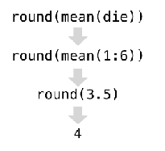

```{r setup, include=FALSE}
knitr::opts_chunk$set(collapse = TRUE, fig.path = "figures/")
```

A linguagem `R` é um tanto quanto intuitiva, muita coisa sai do jeito certo no 
chute! Para ver um exemplo disso, é interessante começar fazendo do R uma grande calculadora. Tente jogar no console `2*2 - (4 + 4)/2`. Pronto. Com essa simples 
expressão você já é capaz de imaginar (e certeiramente) como pedir ao R para fazer qualquer tipo de operação aritmética. Lição aprendida!

Além do mais, as operações e suas precedências são mantidas como na matemática, 
ou seja, divisão e multiplicação são calculadas antes da adição e subtração. 
E os parênteses nunca são demais!

## RStudio

Talvez você tenha imaginado qual seria o resultado da operação, mas ainda não 
tenha conseguido calcular usando o R, porque você não sabe onde digitar aquilo, 
por isso vamos apresentar o RStudio.

O RStudio é um (o melhor) IDE (*integrated development environment*) para o R.
E você pode fazer o download [aqui](https://www.rstudio.com/products/rstudio/download3/). 
Estamos assumindo que você já instalou o próprio R. Se não instalou, [clique aqui](https://cloud.r-project.org/).

Assim que abrir o RStudio você verá a seguinte tela.


Nela estão dispostos **editor**, **console**, **environment** e **output**. 
Normalmente eles vêm nesta ordem, depois você pode organizá-los da forma que
preferir. Preste atenção a todos esses campos durante este tutorial.

Agora que você já conhece o RStudio, digite a expressão `2*2 - (4 + 4)/2` no
**console** e tecle `Enter`. Uma outra forma de chamar uma expressão é escrever
o código no **editor** e teclar `Ctrl + Enter`. Assim o comando é enviado para 
o **console** onde é diretamente executado.

## Usando o console

Pelo console é possível executar qualquer comando do R.

```{r}
1:30
```

Esse comando é uma forma simplificada de criar um vetor de inteiros de 1 a 30.
Você pode ignorar esses números que aparecem entre parênteses, na verdade eles 
só indicam o índice do primeiro elemento impresso nessa linha.

<div class='admonition note'>
<p class='admonition-title'>
Quando compilamos?
</p>
<p>
Quem vem de linguagens como o C ou Java, espera que seja necessário compilar o código em texto para o código de máquinas (geralmente um código binário). No R, isso não é necessário. O R é uma linguagem de programação dinâmica que interpreta o seu código enquanto você o executa.
</p>
</div>

Se você digitar um comando incompleto, como `5 + ` e apertar `Enter`, o R irá mostrar
um `+`, o que não tem nada a ver com somar alguma coisa, e sim significa que o
R está esperando que você complete o seu comando. Termine o seu comando ou aperte
`Esc` para recomeçar.

```
> 5 -
+ 
+ 5
[1] 0
```

Se você digitar um comando que o R não reconhecer, ele irá retornar uma mensagem
de erro. Não entre em pânico. Ele só está avisando que não conseguiu interpretar
o comando. Depois você já pode digitar mais um comando.

```
> 5 % 5
Error: unexpected input in "5 % 5"
> 5 - 5
[1] 0
```

## Objetos

O R permite que você salve dados guardando estes dentro de um objeto. Um objeto 
nada mais é do que um nome, que pode ser utilizado para chamar dados armazenados.
Por exemplo, você pode salvar dados em `a`. Sempre que o R encontrar o nome `a`
ele o substituirá pelos dados armazenados em `a`. Por exemplo:

```{r}
a <- 1
a + 1
```

No Rstudio, quando um objeto é criado, ele começa a aparecer no painel **environment**. Essa é uma ótima forma de acompanhar todos os objetos que estão
disponíveis no seu *environment*. Outro ponto que é importante lembrar aqui é que 
o R entende letras maiúsculas e minúsculas, isto é `a` é considerado um objeto
diferente de `A`.

```
> a
[1] 1
> A
Error: object 'A' not found
```

<div class='admonition note'>
<p class='admonition-title'>
<- ou = ?
</p>
<p>
Essa pergunta é comum, e a resposta padrão é: melhor usar <-. No entanto, na maioria dos casos os dois são equivalentes. Portanto, use qual você achar melhor e seja consistente. Uma boa referência é este <a href="http://pt.stackoverflow.com/a/160092/6036">link</a>
</p>
</div>

O R substitui os valores de um objeto sem pedir permissão. Então, se você não
deseja sobreescrever o valor de um objeto, não use o mesmo nome.

```{r}
a <- 1
a
a <- 2
a
```

Agora, vamos definir um novo objeto no R, chamado `vetor`.

```{r}
vetor <- 1:10
```

De forma bastante intuitiva, você pode fazer operações com vetores.

```{r}
vetor - 1
vetor / 2
vetor * 10
```

Quando você faz `vetor - 1`, o R subtrai `1` de cada um dos elementos do vetor.
O mesmo acontece quando você faz qualquer operação aritmética com vetores no R.

Você também pode fazer operações que envolvem mais de um vetor. Exemplo:

```{r}
vetor * vetor
```

Neste caso, o R irá alinhar os dois vetores e multiplicar elemento por elemento.
Isso pode ficar um pouco confuso quando os dois vetores não possuem o mesmo
tamanho:

```{r}
vetor2 <- 1:2
vetor2
vetor * vetor2
```

Agora o R alinhou os dois vetores, e como eles não possuiam o mesmo tamanho, ele
foi repetindo o menor vetor até completar o vetor maior. Isso retornaria um warning
se o tamanho do maior não fosse múltiplo do tamanho do vetor menor.

```
> vetor * vetor3
 [1]  1  4  9  4 10 18  7 16 27 10
Warning message:
In vetor * vetor3 :
  longer object length is not a multiple of shorter object length
```

Esse comportamento é chamado de **reciclagem**. Isso é útil para fazer operações 
com os vetores elementos por elementos (vetorizadamente), mas as vezes pode ser
confuso. Com o tempo você aprenderá a se aproveitar desse comportamento.

## Funções

O R vem com muitas funções implementadas com as quais você pode fazer muitas 
tarefas complicadas, como gerar números aleatórios. Geralmente o nome das funções
é bem intuitivo, por exemplo `mean` é a função que calcula a média, `round` é a
função que arredonda um número, etc.

```{r}
pi
round(pi)
```

Para entender melhor o funcionamento das funções no R considere o seguinte exemplo.

```{r}
die <- 1:6
round(mean(die))
```

De forma natural, o R executa as funções uma a uma começando por dentro dos parênteses. Neste caso, ele primeiro substituirá `die` pelo seu valor, em seguida
irá calcular a média de `die` usando a função `mean`. Em seguida ele usa a função
`round` para arredondar a média de `die`.

A ilustração abaixo ajuda a entender o que acontece quando você executa `round(mean(die))` no R.



Passamos dados para as funções por meio de argumentos. No R, esses argumentos estão
documentados na página de ajuda de cada uma das funções, que pode ser acessada
digitando `help(nome_da_funcao)` ou `?nome_da_funcao`.

### Criando suas próprias funções

Apesar de já existirem uma infinidade de funções disponíveis no R, muitas vezes
você deseja criar a sua própria função. Por exemplo, para organizar uma sequência
de funções que são executadas da mesma forma em diversos lugares do seu código.

Funções no R também são objetos, assim como vetores. A diferença é a forma de 
criá-los e de executá-los. Uma nova função pode ser criada da seguinte forma:

```{r}
my_function <- function(x){
  x/2
}
```

Pronto. Criamos uma função que divido o argumento `x` por 2. Você pode ver o 
código de qualquer função do R digitando o nome dela no console (sem parênteses no
final).

```{r}
my_function
```

## Controles de Fluxo

O R possui estruturas de controle de fluxo que são importantes na hora de programar
as suas próprias funções e scripts. O seguinte trecho de código só será executado se
o objeto `x` for igual a 1.

```{r}
x <- 2
if(x == 1){
  print("oi")
}
```

```{r}
x <- 1
if(x == 1){
  print("oi")
}
```

A estrutura do `if` é bem simples, mas é importante para introduzir a noção de 
vetores lógicos no R. Assim como nas funções, o R executa o que está dentro dos
parênteses no `if` para depois decidir se executa a expressão dentro de chaves.

No caso dos exemplos acima, veja que o R executou `x == 1` que retorna `TRUE`,
um tipo especial de dados no R chamado **logical**.

```{r}
x == 1
```

Como o resultado dessa operação foi `TRUE`, o R executou o que estava entre chaves.
Isso nos ajuda a pensar em como funcionam as operações lógicas no R, elas sempre
retornam `TRUE` ou `FALSE` como resultado. O resultado de operações lógicas também
pode ser salvo dentro de objetos do R e em seguiida ser reutilizado em outras
operações. Por exemplo:

```{r}
a <- x == 1
b <- x == 2
c <- a & (!b)
if(c){
  print("oi")
}
```

Isso pode ser bastante útil e ajuda a entender bem como o R funciona.

Uma outra importante estrutura de controle de fluxo é o `for`. No Rm, um laço `for`
é escrito da seguinte forma.

```{r}
for(i in 1:5){
  print(i)
}
```

Veja como é possível utilizar o obejto `i` dentro do laço do `for`. Para fazer
operações mais úteis usando `for`, é necessário entender um pouco sobre *subsetting*
no R. Por enquanto vamos apenas usar que dado um vetor `x`, `x[i]` retorna o *i-ésimo*
elemento do vetor `x`. Note que os índices começam do 1, ao contrário de muitas 
outras linguagens em que os índices começam do 0.

```{r}
vetor <- 30:40
indices <- 1:length(vetor)
for(i in indices){
  print(vetor[i]/2)
}
```

No trecho de código acima, preste atenção no resultado individual de cada uma das
operações para entender como o R funciona. Veja o que é o vetor `indices`, tente rodar `vetor[1]` para ver quais são esses resultados intermediários.
